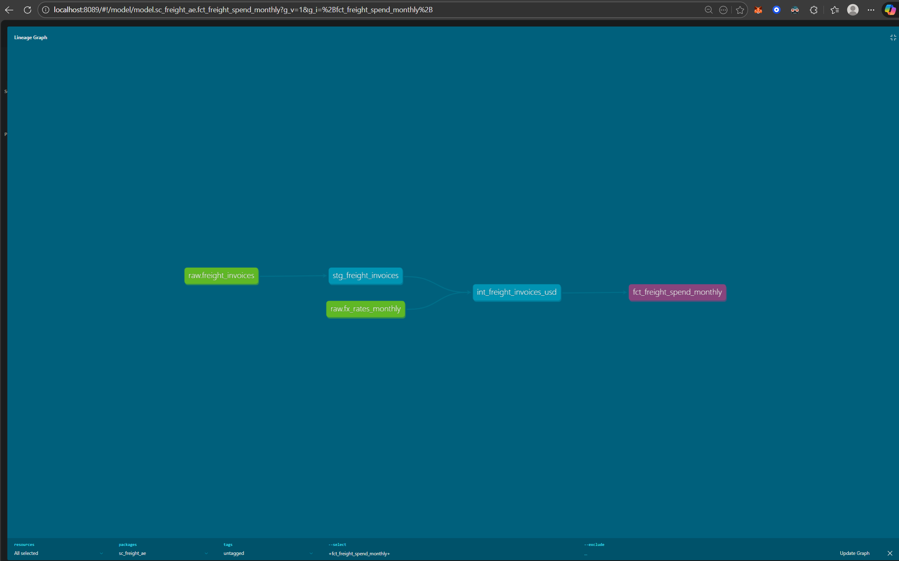

# Supply Chain Freight Analytics Engineering Project

A Snowflake + dbt analytics engineering project modeling multi-currency freight invoices into clean, tested, analytics-ready data marts.

## Project Goal

This project simulates a real-world freight spend analytics pipeline:

- Raw freight invoices (multiple currencies)
- Monthly FX rate normalization
- Clean staging layer
- Business-logic intermediate layer
- Aggregated fact table for reporting
- Data quality tests

The end result is a production-style `fct_freight_spend_monthly` mart suitable for BI tools like Power BI or Looker.

## Lineage Graph

Below is the dbt lineage graph showing the full transformation flow from raw sources to final analytics mart.

